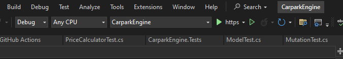
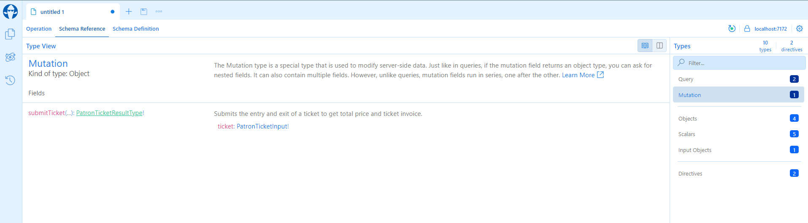
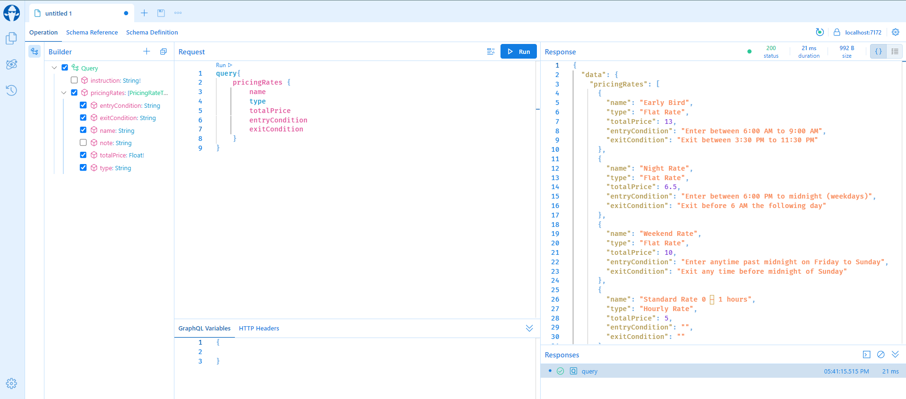
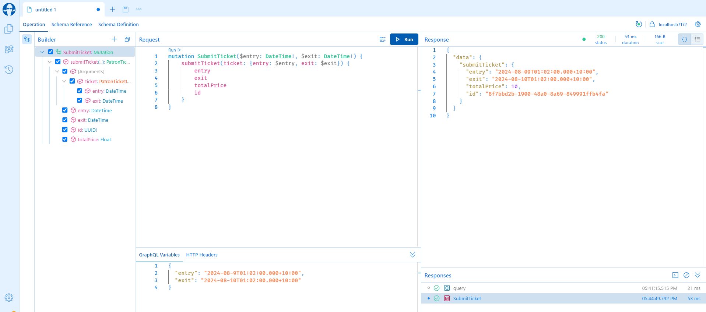
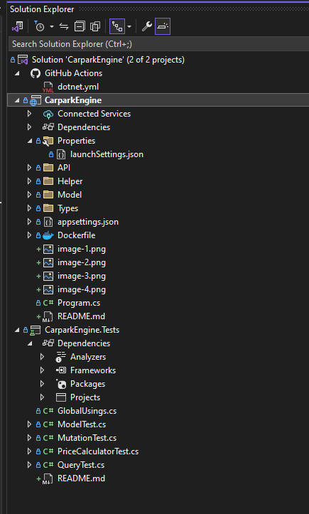

# VinhNgo-Emprevo-Challenge-Carpark-Engine

Welcome to the Emprevo Carpark Engine.

This project is the attempt of Vinh Ngo in the Emprevo Coding Challenge.

It is an ASP.NET 8.0 application that uses GraphQL API instead of REST to proccess ticket prices based on entry and exit time input.
It also comes with an Angular 18 GUI application [Emprevo Carpark Engine UI](https://github.com/vinhngogia0906/VinhNgo-Emprevo-Coding-Challenge/tree/main/CarparkEngineUI).

## Prerequisites

In order to start the project, you will need to install these software and tools:
- [.NET SDK and Runtime](https://dotnet.microsoft.com/en-us/download/dotnet/8.0) - This is required to build the backend application.
- [Visual Studio](https://visualstudio.microsoft.com/thank-you-downloading-visual-studio/?sku=Community&channel=Release&version=VS2022&source=VSLandingPage&cid=2030&passive=false) - Recommended IDE

## Getting Started
This is how you set up and run the project locally in your environment.

1. Open the solution file of the `CarparkEngine` folder inside the cloned [repository](https://github.com/vinhngogia0906/VinhNgo-Emprevo-Coding-Challenge) with Visual Studio
2. Build the solution with the Visual Studio's Build tool.
3. Start the project in debug mode. The application is configured to run with a Docker container. However, for the sake of simplicity, I recommend running with the configuration like the below screenshot.

4. A browser tab will be open and you will see the GraphQL playground GUI where you can examine the schema and all the API Documentation.

5. You can test the APIs with the Swagger playground like this:

6. You can also test the settlement service with the [Emprevo Carpark Engine UI](https://github.com/vinhngogia0906/VinhNgo-Emprevo-Coding-Challenge/tree/main/CarparkEngineUI) for the most complete experience. Make sure you note down the backend graphQl uri and follow the GUI application's instructions to put it in the right place. In this case, it is `https://localhost:7172/graphql/` but it might be different when you start debugging in your environment.
7. You can also run the unit tests with the dependency [Emprevo Carpark Engine Test](https://github.com/vinhngogia0906/VinhNgo-Emprevo-Coding-Challenge/tree/main/CarparkEngine.Tests) in the same solution.

8. Otherwise, you can see the testing results via the [Git Action](https://github.com/vinhngogia0906/VinhNgo-Emprevo-Coding-Challenge/actions).