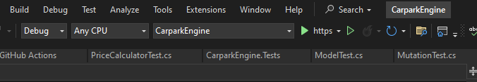
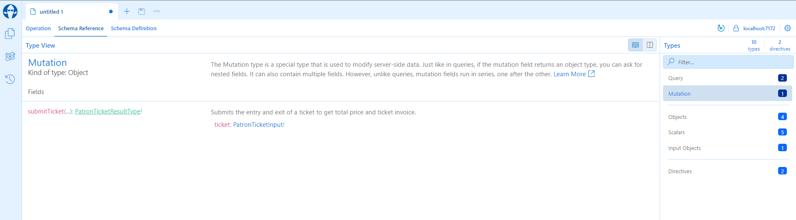
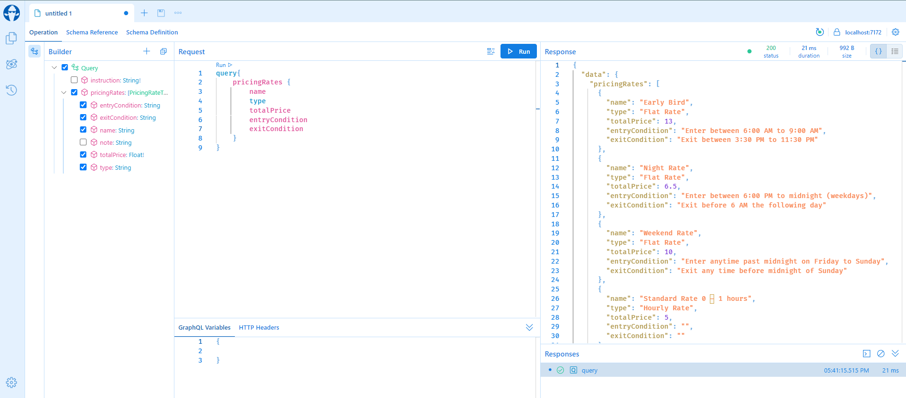
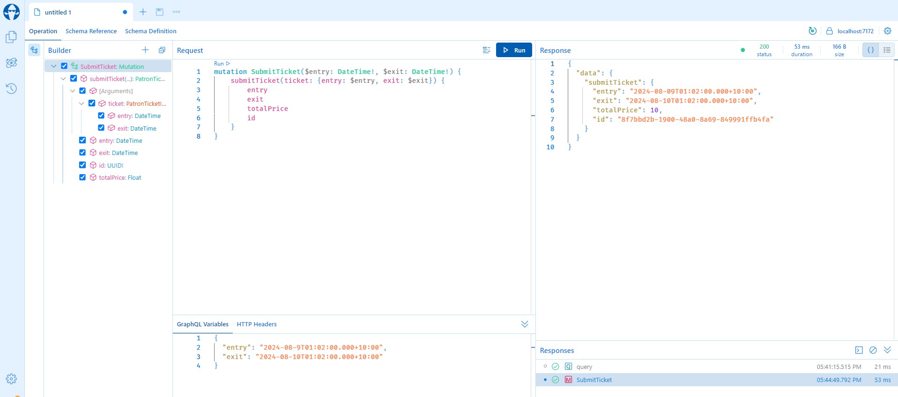
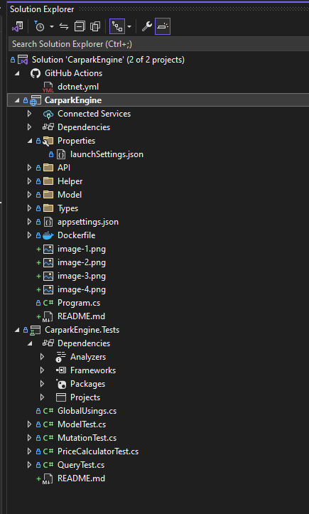

# Carpark Engine (Backend)

An ASP.NET 8.0 application that calculates parking ticket prices through a GraphQL API powered by HotChocolate.

## Prerequisites

- [.NET 8.0 SDK and Runtime](https://dotnet.microsoft.com/en-us/download/dotnet/8.0)
- [Visual Studio 2022](https://visualstudio.microsoft.com/) (recommended)

## Getting Started

1. Open the solution file from the `CarparkEngine` folder in Visual Studio.
2. Build the solution.
3. Start in debug mode (select **Any CPU / https** for simplicity over Docker).
   
4. The GraphQL Banana Cake Pop playground opens in the browser for schema exploration and API testing.
   

## API

### Query: `pricingRates`
Returns all pricing rates with names, prices, and conditions.

### Mutation: `submitTicket(entry, exit)`
Accepts entry/exit `DateTime` values and returns a session ID, timestamps, and the calculated total price.

## Companion Projects

- [Carpark Engine UI](../CarparkEngineUI) -- Angular frontend for this API
- [Carpark Engine Tests](../CarparkEngine.Tests) -- xUnit test project in the same solution

## Unit Tests

Tests can be run from the Visual Studio Test Explorer or via the [GitHub Actions CI](https://github.com/vinhngogia0906/VinhNgo-Emprevo-Coding-Challenge/actions).

