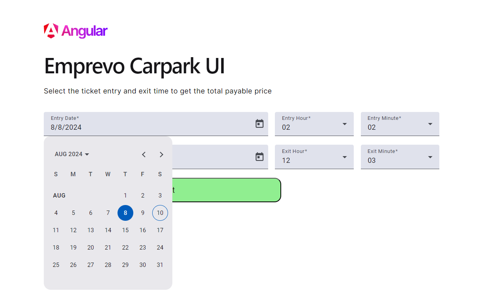
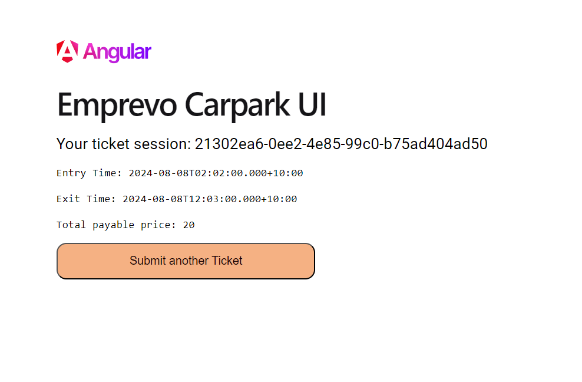

# VinhNgoEmprevoChallengeCarparkEngineUI

Welcome to the Emprevo Carpark Engine UI Application.
This project was generated with [Angular CLI](https://github.com/angular/angular-cli) version 18.1.4 and serves as the frontend application for [CarparkEngine App](https://github.com/vinhngogia0906/VinhNgo-Emprevo-Coding-Challenge/tree/main/CarparkEngine)

Again, I invited myself to use GraphQL API instead of REST to communicate with the backend application, because why not?

## Prerequisites

It is important to notice that this project is written in Angular version 18.1.4 so you need to make sure you have all these installed with the required version:
- [NodeJs](https://nodejs.org/en/download) - NodeJs has to be version v20.16.0
- [Npm](https://docs.npmjs.com/downloading-and-installing-node-js-and-npm) - Npm needs to be version v10.8.2 at least.
- [Visual Studio Code](https://code.visualstudio.com/download) - Recommended IDE

## Getting Started
This is how you set up and run the project locally in your environment.

1. Open the `CarparkEngineUI` folder inside the cloned [repository](https://github.com/vinhngogia0906/VinhNgo-Emprevo-Coding-Challenge) with Visual Studio Code.
2. Install all the enlisted packages (only after you meet all the version requirements above):
```
npm install 
```
3. Follow the [Carpark Engine App](https://github.com/vinhngogia0906/VinhNgo-Emprevo-Coding-Challenge/tree/main/CarparkEngine)'s instruction to start it up in debug mode.
4. Check the graphQL Uri your local setup of [Carpark Engine App](https://github.com/vinhngogia0906/VinhNgo-Emprevo-Coding-Challenge/tree/main/CarparkEngine) and update it in the `src\environment.ts` file if not match. In this case, it is `https://localhost:7172/graphql`, but it might be different when you start debugging in your environment.
5. Run the application with this command.
```
npm run start
```
6. Navigate to `http://localhost:4200/`. The application will automatically reload if you change any of the source files.

7. Use the form to submit your ticket entry and exit time to get the price



## Code scaffolding

Run `ng generate component component-name` to generate a new component. You can also use `ng generate directive|pipe|service|class|guard|interface|enum|module`.

## Build

Run `ng build` to build the project. The build artifacts will be stored in the `dist/` directory.

## Running unit tests

Run `ng test` to execute the unit tests via [Karma](https://karma-runner.github.io).

## Running end-to-end tests

Run `ng e2e` to execute the end-to-end tests via a platform of your choice. To use this command, you need to first add a package that implements end-to-end testing capabilities.

## Further help

To get more help on the Angular CLI use `ng help` or go check out the [Angular CLI Overview and Command Reference](https://angular.dev/tools/cli) page.
