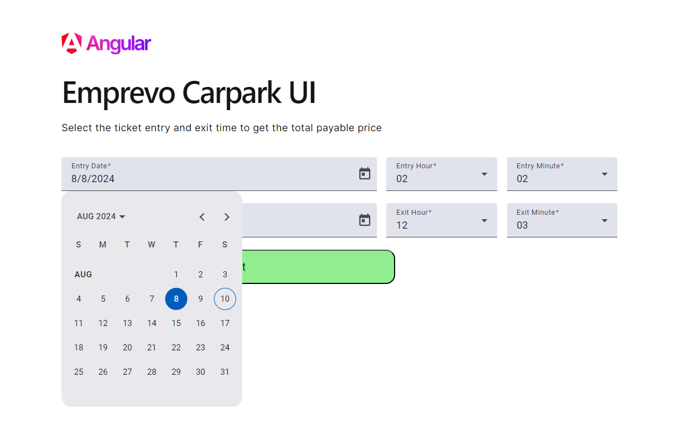
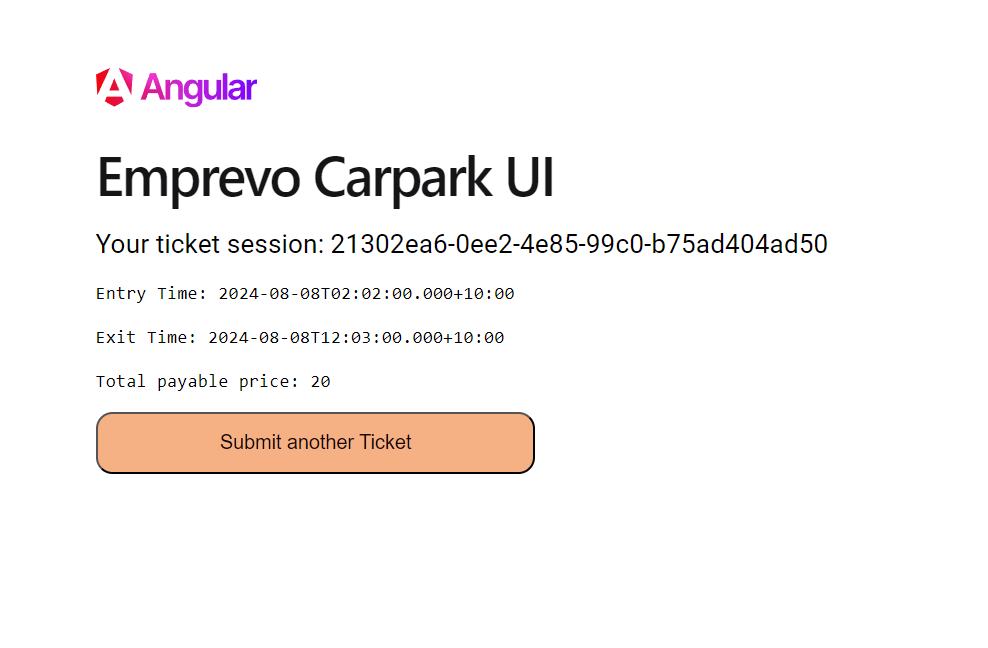

# Carpark Engine UI (Frontend)

An Angular 18 application that provides a GUI for the [Carpark Engine](../CarparkEngine) backend. It communicates via GraphQL (Apollo Client) to submit parking entry/exit times and display calculated prices.

## Prerequisites

- [Node.js](https://nodejs.org/en/download) v20.16.0+
- [npm](https://docs.npmjs.com/downloading-and-installing-node-js-and-npm) v10.8.2+
- [Visual Studio Code](https://code.visualstudio.com/download) (recommended)

## Getting Started

1. Open the `CarparkEngineUI` folder in VS Code.
2. Install dependencies:
   ```
   npm install
   ```
3. Start the [Carpark Engine](../CarparkEngine) backend and note its GraphQL URI.
4. Update `src/environment.ts` if the URI differs from the default (`https://localhost:7172/graphql`).
5. Start the dev server:
   ```
   npm start
   ```
6. Open `http://localhost:4200/`.

## Usage

Submit parking entry/exit date and time through the form. The app sends a GraphQL mutation and displays the calculated price.




## Scripts

| Command | Description |
|---------|-------------|
| `npm start` | Start the dev server |
| `npm run build` | Build for production (output in `dist/`) |
| `npm test` | Run unit tests via Karma |
